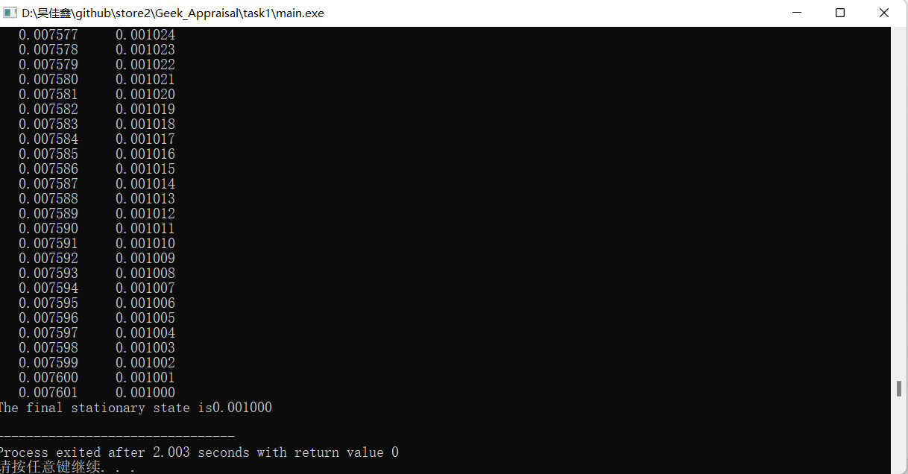

# 任务1实验报告模板

### 题目

C语言编写欧拉法求解下述微分方程的各个瞬时值与最终定态（收敛值）：
$$
\left\{
\begin{matrix}
y'+y=0 \\
y(0)=a
\end{matrix}
\right.
$$
注：a为常数，可由用户输入确定该值

***

### 运行结果截图：

（以下图为例，放入运行结果的截图，结果打印的输出格式可自己设置）

---

### 思考题（请给出思考结论）：

1. 当a为1，给出x在区间[0，25]之间方程的各个瞬时值，该方程的最终定态（收敛值）是多少？
2. 当a为e，给出x在区间[0，25*e]之间方程的各个瞬时值，最终定态（收敛值）是多少？（e为指数）
3. 当a为π，给出x在区间[0，25*π]之间方程的各个瞬时值，最终定态（收敛值）是多少？
4. 上面三小问中不同初值的方程最终都能取到各自的最终定态（收敛值），为什么？

#### 附加题：

使用C语言对上述前三问的数值求解过程用Excel画图显示，即将每一个x对应的y值在坐标系上画出来，并将绘图结果附在本文档中。

