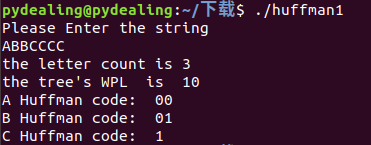

### 完成下面的代码和注释

```c
#include<stdio.h>
#include<stdlib.h>
#include<string.h>

//查找结点i的父结点,通过递归得到结点到根的长度
int findParent(int i,int huffman[][4],int n);
//根据初始权重构建哈夫曼树
void huffmanTree(int w[],int huffman[][4],int n);
//寻找权重最小的两个节点
void findMin(int ii[],int huffman[][4],int n);
//对每个叶节点进行哈夫曼编码
void HuffmanCode(int i,int huffman[][4],int n);
//交换两个char型数据
void inplace_swap(char *x,char *y);

int main()
{
    //对输入的字符串进行记录，对字符的总个数count以及各个字符的出现次数arr_small[]进行统计
    char str[100];
    printf("Please Enter the string\n");
    scanf("%s", str);
    int arr_big[27] = {0};  //各个字符的出现次数
    int count = 0;  //字符的总个数
    for(int i = 0; i < strlen(str); i++)    //遍历输入字符串中的所有字符
    {
        for(int j = 0; j < 27; j++) //遍历26个大写字母
        {
            if(str[i] == (char)(0x41 + j))
            {
                arr_big[j] += 1;
                if(arr_big[j] == 1)
                {
                    /*自行填充代码*/		//记录一共出现了几个字母
                }
                break;
            }
        }
    }
    printf("the letter count is %d\n",count);   //打印输入字符串出现了几个字母

    //通过arr_big对输入字符串中出现的字母次数进行统计，放入数组arr_small中
    int count2 = 0;     //字符串中出现的字符总个数
    int arr_small[count] ;  //统计输入字符串中字母的出现次数
    for(int i = 0; i < 27; i++)
    {
        if(/*自行填充代码*/)
        {
            arr_small[count2++] = arr_big[i];	/*补充注释（说明作用）*/
        }
    }

    //定义int型二维数组，数组长度[*]为哈夫曼树的节点个数
    //c[*][0]存放的是该节点的[父节点的位序]，c[*][1]为该节点的[左子树节点的位序]
    //c[*][2]存放该节点的[右子树节点的位序]，c[*][3]为该节点的权值
    int huffman[2 * count - 1][4];  //前n个为叶结点，后n-1个为中间结点

    //根据初始权重数组arr_small和字符个数构建huffman树
    huffmanTree(arr_small,huffman,count);

    //计算Huffman生成树的总长度WPL
    int sum = 0;
    for(int i = 0;i < count;i++)
    {
        int length = 0;
        if(huffman[i][1] == -1 && huffman[i][2] == -1)  /*补充判断模块注释*/
        {
            length = findParent(i,huffman,count);   //得到各个叶结点的带权路径长度
            /*自行填充代码*/  	//各个叶结点带权路径长度累加得到总长度WPL
        }
    }
    printf("the tree's WPL  is  %d\n",sum);

    //Huffman编码
    for(int i = 0;i < count;i++)
    {
        HuffmanCode(i,huffman,count);
    }

    return 0;
}

//子函数——构建哈夫曼树
void huffmanTree(int w[],int huffman[][4],int n)
{
    //结点初始化
    for(int i = 0; i < 2 * n - 1; i++)
    {
        huffman[i][0] = -1;
        huffman[i][1] = -1;
        huffman[i][2] = -1;
        huffman[i][3] = -1;
    }
    /*补充注释（说明作用）*/
    for(int i = 0; i < n; i++)
    {
        huffman[i][3] = w[i];
    }
    //每次抽出两个权重最小的结点进行合并，直到最终产生根结点
    for(int i = n; i < 2 * n - 1; i++)
    {
        int i1,i2;  //权重最小的两个结点
        int ii[2]; 
        //找出两个权重最小的结点
        findMin(ii,huffman,n);
        i1=ii[0];
        i2=ii[1];
        //合并i1、i2结点,更新结点信息（新生成结点的左右子结点，子节点对应的父结点，新生成结点的权重）
        
        /*自行填充代码*/
        
    }
}

//子函数——找出两个权重最小的结点
void findMin(int ii[],int huffman[][4],int n)
{
    //找出第一个权重最小的结点
    int min = 9999999;
    for(int i = 0; i < 2 * n - 1; i++)
    {
        if(huffman[i][3] == -1 && huffman[i][0] == -1)  /*补充判断模块注释（说明作用）*/
        {
            break;
        }
        if(huffman[i][3] < min && huffman[i][0] == -1)  /*补充判断模块注释（说明作用）*/
        {
            min = huffman[i][3];
            ii[0] = i;
        }
    }

    //找出第二个权重最小的结点（模仿上部分自行编写）
    
    /*自行填充代码*/
    
}

//子函数——查找结点i的父结点,得到结点到根的长度
int findParent(int i,int huffman[][4],int n)
{
    int length = 0;
    if(huffman[i][0] == -1)     /*补充判断模块注释*/
    {
        return 0;
    }
    length += (findParent(huffman[i][0],huffman,n) + 1);    //通过递归得到结点到根的路径长度
    return length;
}

//子函数——对每个叶节点进行哈夫曼编码并进行打印
void HuffmanCode(int i,int huffman[][4],int n)
{
    char code[30];  //char数组填充编码
    int current=i;  //定义当前访问的结点
    int father = huffman[i][0]; //定义当前结点的父节点
    int start=0;    //每次编码的位置，初始为编码倒数位置
    int first,last;     //char数组的头部和尾部

    while(father != -1)
    {
        /*自行填充代码*/		//判断当前结点的父结点左子树是否为当前结点
        /*自行填充代码*/		//子结点是父结点的左子树，编码为0
        /*自行填充代码*/		//子结点是父结点的右子树，编码为0

        /*自行填充代码*/		//往上朔源，更新当前结点
        /*自行填充代码*/		//同理（当前结点更新后），更新当前结点的父亲结点
        /*自行填充代码*/		//更新编码位置
    }
    code[start]='\0';   //编码结束符

    //将char数组中的元素头尾两端进行对调
    for(first = 0, last = start-1; first < last; first++,last--)
    {
        //对调数组内部元素
        inplace_swap(&code[first], &code[last]);	/*该函数可自己重写*/
    }

    printf("%c Huffman code:  %s\n",'A'+i,code);    //打印字符的huffman编码
}

//子函数——交换两个char型数据（使用了布尔运算），可自己另外用可读性较好的方法重新实现改函数
void inplace_swap(char *x,char *y)
{
    *y = *x ^ *y;
    *x = *x ^ *y;
    *y = *x ^ *y;
}
```

***

### 运行截图：



对字符串进行Huffman编码，得到WPL和各字符编码：

（1）DEAEDDEDBCEEECECDEEDDBEEECEEDEE

（2）EEBEACCCCAADACCBCCCCECCCEEECCCE

---

### 思考题

1. 当Huffman树的叶结点为n时，整个生成树的结点总数为何是2n-1？
2. 该代码可以对大写字母的字符串进行huffman编码，如果要读小写字母字符串进行编码，应该如何修改？如果想要对同时具有大写和小写字母的字符串都进行编码呢（写出思路即可）？
3. 使用画图工具画出上述两个Huffman生成树的生成过程
