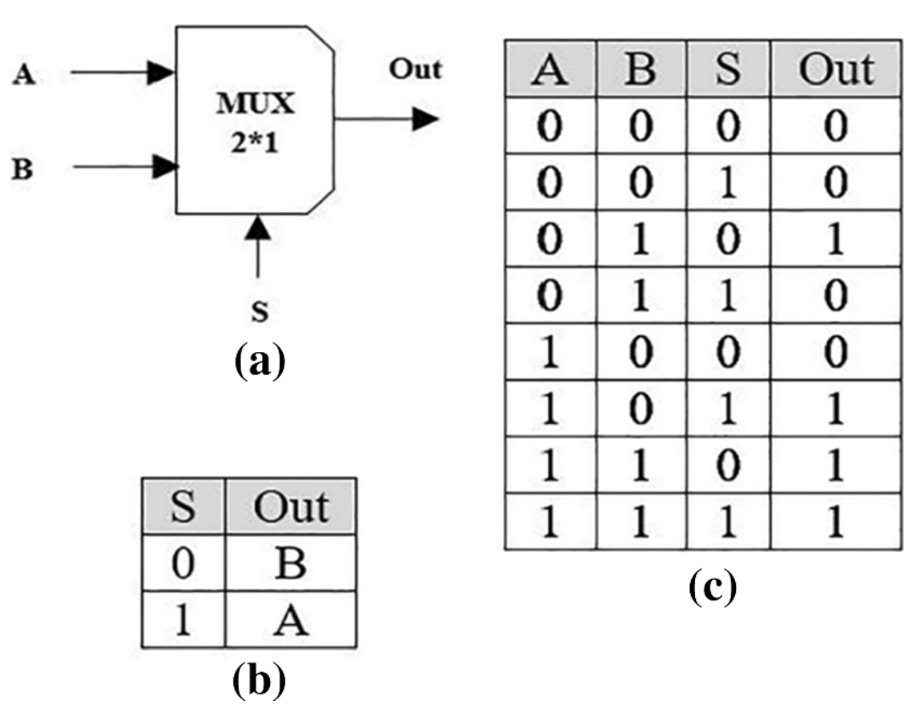
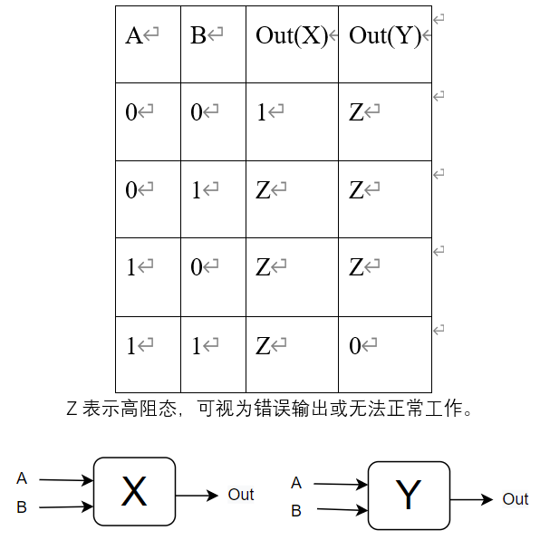

# 任务3
请在以下三个题目中选择两个进行思考和并给出思考结论。

***

### 题目一
多选器是一种基本的数字电路器件，其功能如下：

图(a)为一个2选1选择器。A,B,s作为输入端，其中A，B为1位的数据输入，s为1位的选择信号，Out为1位的输出端，当s=0时out=B，当s=1时out=A。

1. 如何使用图(a)所示的2选1多选器设计一个具有5个数据输入的多选器？这个多选器需要几位选择信号? 画出你的设计。

2. 如果使用图(a)所示的2选1多选器设计一个具有n个数据输入的多选器, 需要多少个2选1的选择器? 写下你的结论和思考步骤。

***

### 题目二
一个集成电路学院的同学在网上买零件的时候被骗，奸商卖给他的逻辑门X，Y的输出如下表所示：

1. 该同学需要用X与Y这两个逻辑门实现异或门(XOR)，你有什么建议？画出你的电路结构图。

***

### 题目三

逻辑电路G1如下，它是一个3输入3输出的数字电路：

1. 如何在使用非门(Not gate)最少的情况下实现该电路？画出你的电路，或者使用逻辑表达式写出你的电路。(你可以使用非门(Not gate), 与门(AND gate), 或门(OR gate), 异或门(XOR gate))
